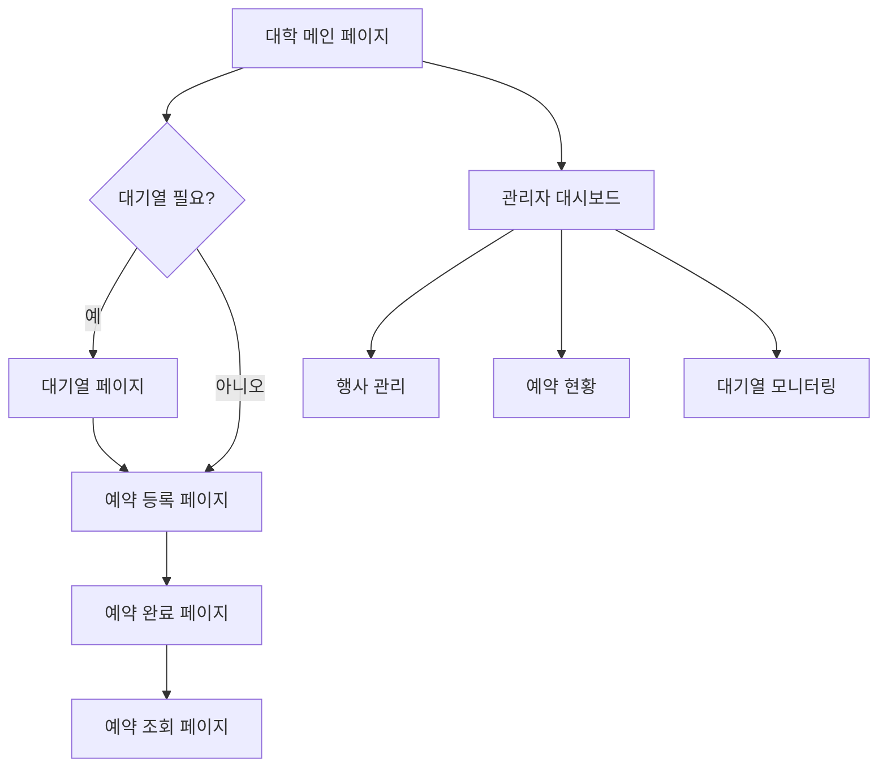

## 1. 제품 개요
멀티테넌트 대학 행사 예약 시스템은 여러 대학이 독립적으로 행사를 관리하고 학생들이 온라인으로 예약할 수 있는 통합 플랫폼입니다. 대학 관리자는 행사를 생성하고 관리하며, 학생들은 간편한 예약 프로세스를 통해 행사에 참가할 수 있습니다.

이 시스템은 대학 행사의 디지털화를 촉진하고, 대기열 관리를 통한 서버 부하 분산으로 대규모 예약 트래픽을 효과적으로 처리합니다.

## 2. 핵심 기능

### 2.1 사용자 역할

| 역할 | 등록 방법 | 핵심 권한 |
|------|-----------|----------|
| 대학 관리자 | 이메일 초대 및 승인 | 행사 생성/수정/삭제, 예약 현황 조회, 대기열 관리 |
| 학생 사용자 | 학번 인증 및 이메일 | 행사 예약, 예약 조회/취소, 대기열 참여 |
| 시스템 관리자 | 수퍼관리자 권한 | 대학 계정 관리, 시스템 설정, 전체 통계 조회 |

### 2.2 기능 모듈

대학 행사 예약 시스템은 다음 주요 페이지로 구성됩니다:

1. **관리자 대시보드**: 행사 관리, 예약 현황, 통계, 대기열 모니터링
2. **대학 메인 페이지**: 행사 목록, 예약 버튼, 대기열 상태 표시
3. **대기열 페이지**: 실시간 대기 순위, 예상 대기 시간, 진행 상태
4. **예약 등록 페이지**: 신청자 정보 입력, 좌석 선택, 결제 정보
5. **예약 완료 페이지**: 예약 확인서, QR 코드, 상세 정보
6. **예약 조회/취소 페이지**: 예약 상태 확인, 취소 요청

### 2.3 페이지 상세

| 페이지명 | 모듈명 | 기능 설명 |
|----------|---------|-----------|
| 관리자 대시보드 | 행사 관리 | 행사 생성, 수정, 삭제, 상태 변경 |
| 관리자 대시보드 | 예약 현황 | 실시간 예약 통계, 참가자 명단 엑셀 다운로드 |
| 관리자 대시보드 | 대기열 모니터링 | 현재 대기 인원, 처리 속도, 대기 시간 분석 |
| 대학 메인 페이지 | 행사 목록 | 카드 형식의 행사 표시, 필터링 및 검색 기능 |
| 대학 메인 페이지 | 실시간 상태 | 잔여 좌석 수, 마감 임박 행사 알림 |
| 대기열 페이지 | 대기 순위 표시 | 실시간 대기 순위 업데이트, 예상 대기 시간 계산 |
| 대기열 페이지 | 진행 상태 | 현재 처리 중인 사용자 수, 시스템 상태 표시 |
| 예약 등록 페이지 | 신청자 정보 | 학번, 이름, 연락처, 소속 학과 입력 |
| 예약 등록 페이지 | 좌석 선택 | 좌석 배치도 표시, 선택 가능 좌석 하이라이트 |
| 예약 완료 페이지 | 확인서 발급 | 예약 번호, QR 코드, 행사 상세 정보 표시 |
| 예약 조회 페이지 | 상태 확인 | 예약 상태, 결제 정보, 변경 이력 조회 |
| 예약 조회 페이지 | 취소 요청 | 예약 취소, 환불 정책 안내, 취소 확인 |

## 3. 핵심 프로세스

### 학생 사용자 플로우
학생이 행사를 예약하는 주요 흐름:
1. 대학 메인 페이지 접속 → 행사 선택
2. 예약 버튼 클릭 → 대기열 진입 (필요시)
3. 대기열에서 순번 도달 → 예약 등록 페이지로 이동
4. 개인정보 입력 및 좌석 선택 → 결제 정보 확인
5. 예약 완료 → 확인서 및 QR 코드 발급
6. 예약 조회 페이지에서 상태 확인 가능

### 대학 관리자 플로우
관리자의 행사 관리 흐름:
1. 관리자 대시보드 로그인 → 대학 인증
2. 새 행사 생성 → 기본 정보, 좌석 수, 예약 기간 설정
3. 행사 게시 → 학생들에게 공개
4. 예약 현황 모니터링 → 실시간 통계 확인
5. 대기열 관리 → 필요시 대기열 활성화/비활성화

## 4. 사용자 인터페이스 설계

### 4.1 디자인 스타일
- **주요 색상**: 대학 브랜드 컬러 활용, 기본값은 #1e40af (블루), #f59e0b (앰버)
- **버튼 스타일**: 둥근 모서리(8px), 그림자 효과, 호버 시 색상 변화
- **폰트**: Noto Sans KR, 기본 크기 16px, 제목은 24px-32px
- **레이아웃**: 카드 기반 그리드 시스템, 반응형 12컬럼 그리드
- **아이콘**: 둥근 라인 아이콘, 일관된 두께(2px)

### 4.2 페이지 디자인 개요

| 페이지명 | 모듈명 | UI 요소 |
|----------|---------|----------|
| 관리자 대시보드 | 통계 패널 | 카드 형태의 KPI 위젯, 차트.js를 활용한 그래프, 실시간 업데이트 |
| 대학 메인 페이지 | 행사 카드 | 그리드 레이아웃, 호버 시 확대 효과, 진행률 바 표시 |
| 대기열 페이지 | 대기 상태 | 원형 프로그레스 바, 실시간 카운터, 애니메이션 효과 |
| 예약 등록 페이지 | 입력 폼 | 유효성 검사 실시간 피드백, 단계별 진행 표시기 |
| 예약 완료 페이지 | 확인서 | QR 코드 생성, 인쇄 가능한 형식, 이메일 전송 옵션 |

### 4.3 반응형 디자인
- 데스크톱 우선 접근법 (Desktop-first)
- 브레이크포인트: 1200px, 768px, 480px
- 모바일 터치 최적화: 버튼 최소 44px, 스와이프 제스처 지원
- 테블릿에서는 2컬럼 그리드, 모바일에서는 1컬럼 스택

### 4.4 실시간 기능
- WebSocket을 통한 대기열 실시간 업데이트
- Firebase Realtime Database를 활용한 동기화
- 예약 마감 임박 시 실시간 알림
- 관리자 대시보드의 실시간 통계 갱신