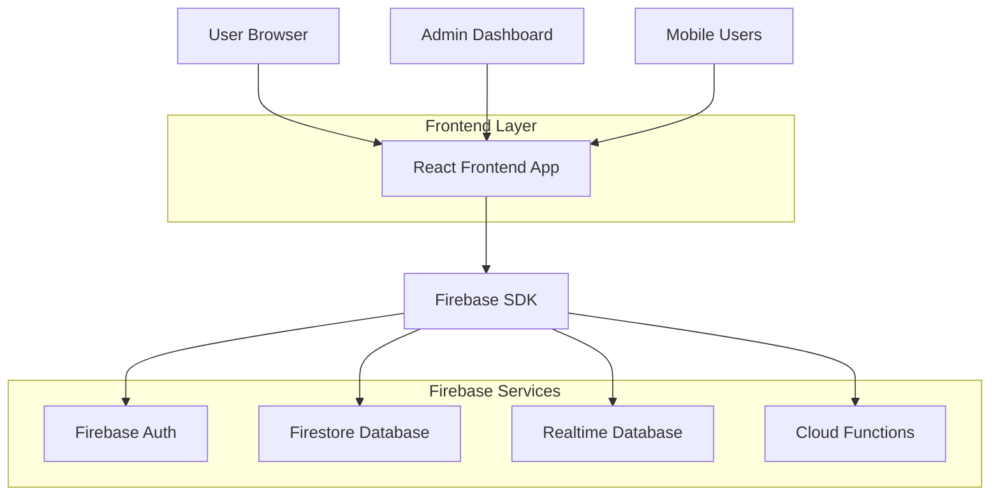
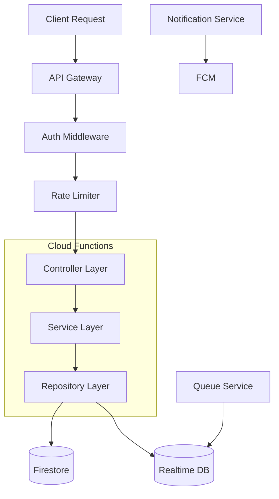
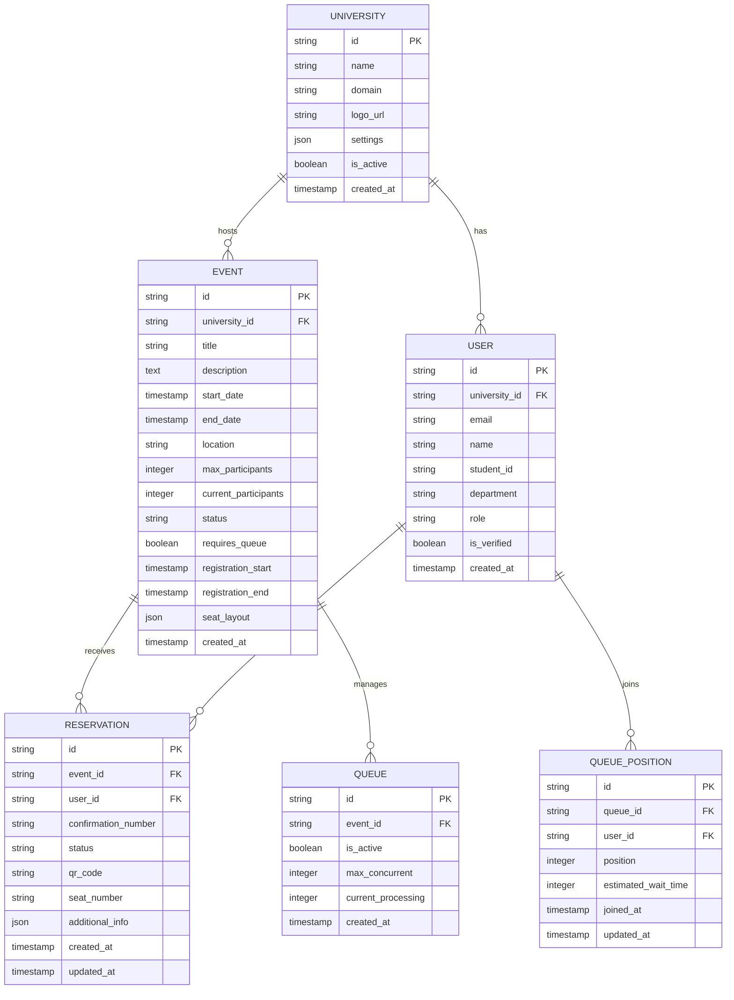

## 1. 아키텍처 설계



## 2. 기술 스택 설명

- **Frontend**: React@18 + TypeScript + Vite
- **Styling**: Tailwind CSS@3 + Headless UI
- **State Management**: React Context API + Zustand
- **Initialization Tool**: vite-init
- **Backend**: Firebase Cloud Functions (Node.js@18)
- **Database**: Firestore (메인 데이터), Realtime Database (대기열)
- **Authentication**: Firebase Auth
- **Hosting**: Firebase Hosting
- **Monitoring**: Firebase Analytics, Sentry

## 3. 라우트 정의

| Route | Purpose |
|-------|---------|
| /admin | 관리자 대시보드, 행사 관리 및 통계 |
| /:schoolId | 대학 메인 페이지, 행사 목록 표시 |
| /:schoolId/queue | 대기열 페이지, 실시간 대기 상태 |
| /:schoolId/register | 예약 등록 폼, 사용자 정보 입력 |
| /:schoolId/complete | 예약 완료 페이지, 확인서 표시 |
| /:schoolId/lookup | 예약 조회 및 취소 페이지 |
| /login | 로그인 페이지 |
| /register | 사용자 회원가입 |

## 4. API 정의

### 4.1 인증 관련 API

**POST /api/auth/register**
```typescript
interface RegisterRequest {
  email: string;
  password: string;
  name: string;
  studentId: string;
  universityId: string;
  department: string;
}

interface RegisterResponse {
  userId: string;
  token: string;
  refreshToken: string;
}
```

**POST /api/auth/login**
```typescript
interface LoginRequest {
  email: string;
  password: string;
}

interface LoginResponse {
  userId: string;
  token: string;
  refreshToken: string;
  role: 'student' | 'admin' | 'super_admin';
}
```

### 4.2 행사 관련 API

**GET /api/events/:schoolId**
```typescript
interface GetEventsRequest {
  schoolId: string;
  status?: 'upcoming' | 'ongoing' | 'past';
  category?: string;
  page?: number;
  limit?: number;
}

interface Event {
  id: string;
  title: string;
  description: string;
  startDate: string;
  endDate: string;
  location: string;
  maxParticipants: number;
  currentParticipants: number;
  status: 'draft' | 'published' | 'closed';
  imageUrl?: string;
  categories: string[];
  createdAt: string;
  updatedAt: string;
}
```

**POST /api/events**
```typescript
interface CreateEventRequest {
  title: string;
  description: string;
  startDate: string;
  endDate: string;
  location: string;
  maxParticipants: number;
  categories: string[];
  registrationStart: string;
  registrationEnd: string;
  requiresQueue: boolean;
  imageUrl?: string;
}

interface CreateEventResponse {
  eventId: string;
  status: 'created';
}
```

### 4.3 예약 관련 API

**POST /api/reservations**
```typescript
interface CreateReservationRequest {
  eventId: string;
  userId: string;
  studentId: string;
  name: string;
  email: string;
  phone: string;
  department: string;
  seatPreference?: string;
  additionalInfo?: Record<string, any>;
}

interface CreateReservationResponse {
  reservationId: string;
  queuePosition?: number;
  status: 'confirmed' | 'queued' | 'waiting_payment';
  qrCode: string;
  confirmationNumber: string;
}
```

**GET /api/reservations/:userId**
```typescript
interface Reservation {
  id: string;
  eventId: string;
  eventTitle: string;
  status: 'confirmed' | 'cancelled' | 'attended' | 'no_show';
  reservationDate: string;
  confirmationNumber: string;
  qrCode: string;
  seatNumber?: string;
  canCancel: boolean;
}
```

### 4.4 대기열 관련 API

**POST /api/queue/join**
```typescript
interface JoinQueueRequest {
  eventId: string;
  userId: string;
}

interface JoinQueueResponse {
  queuePosition: number;
  estimatedWaitTime: number; // minutes
  totalInQueue: number;
}
```

**GET /api/queue/status/:userId**
```typescript
interface QueueStatus {
  position: number;
  estimatedWaitTime: number;
  isActive: boolean;
  processedCount: number;
}
```

## 5. 서버 아키텍처



## 6. 데이터 모델

### 6.1 데이터 모델 정의



### 6.2 데이터 정의 언어

**대학 테이블 (universities)**
```sql
-- Firestore Collection: universities
{
  "id": "string",
  "name": "string",
  "domain": "string",
  "logoUrl": "string",
  "settings": {
    "primaryColor": "string",
    "secondaryColor": "string",
    "maxEventsPerMonth": "number",
    "features": ["string"]
  },
  "isActive": "boolean",
  "createdAt": "timestamp",
  "updatedAt": "timestamp"
}
```

**사용자 테이블 (users)**
```sql
-- Firestore Collection: users
{
  "id": "string",
  "universityId": "string",
  "email": "string",
  "name": "string",
  "studentId": "string",
  "department": "string",
  "role": "student|admin|super_admin",
  "isVerified": "boolean",
  "profile": {
    "phone": "string",
    "avatarUrl": "string"
  },
  "createdAt": "timestamp",
  "updatedAt": "timestamp"
}
```

**행사 테이블 (events)**
```sql
-- Firestore Collection: events
{
  "id": "string",
  "universityId": "string",
  "title": "string",
  "description": "string",
  "startDate": "timestamp",
  "endDate": "timestamp",
  "location": "string",
  "maxParticipants": "number",
  "currentParticipants": "number",
  "status": "draft|published|closed|cancelled",
  "categories": ["string"],
  "imageUrl": "string",
  "requiresQueue": "boolean",
  "registrationStart": "timestamp",
  "registrationEnd": "timestamp",
  "seatLayout": {
    "totalSeats": "number",
    "availableSeats": ["string"],
    "reservedSeats": ["string"]
  },
  "createdAt": "timestamp",
  "updatedAt": "timestamp"
}
```

**예약 테이블 (reservations)**
```sql
-- Firestore Collection: reservations
{
  "id": "string",
  "eventId": "string",
  "userId": "string",
  "confirmationNumber": "string",
  "status": "confirmed|cancelled|attended|no_show",
  "qrCode": "string",
  "seatNumber": "string",
  "additionalInfo": {
    "dietaryRestrictions": "string",
    "specialRequests": "string"
  },
  "cancellationReason": "string",
  "cancelledAt": "timestamp",
  "createdAt": "timestamp",
  "updatedAt": "timestamp"
}
```

**대기열 테이블 (queues)**
```sql
-- Realtime Database Path: /queues/{eventId}
{
  "eventId": "string",
  "isActive": "boolean",
  "maxConcurrent": "number",
  "currentProcessing": "number",
  "processedCount": "number",
  "averageProcessingTime": "number",
  "createdAt": "timestamp"
}
```

**대기열 위치 테이블 (queue_positions)**
```sql
-- Realtime Database Path: /queue_positions/{queueId}/{userId}
{
  "userId": "string",
  "position": "number",
  "estimatedWaitTime": "number",
  "joinedAt": "timestamp",
  "updatedAt": "timestamp"
}
```

## 7. 보안 모델

### 7.1 인증 및 권한
- Firebase Auth를 통한 JWT 기반 인증
- 대학 도메인 기반 이메일 검증
- 역할 기반 접근 제어 (RBAC)

### 7.2 데이터 보안 규칙
```javascript
// Firestore Security Rules
service cloud.firestore {
  match /databases/{database}/documents {
    // Universities - 읽기는任何人, 쓰기는 슈퍼관리자만
    match /universities/{university} {
      allow read: if true;
      allow write: if request.auth.token.role == 'super_admin';
    }
    
    // Users - 본인만 읽기/쓰기, 관리자는 대학 사용자 읽기
    match /users/{user} {
      allow read: if request.auth.uid == userId || 
                     (request.auth.token.role == 'admin' && 
                      request.auth.token.universityId == resource.data.universityId);
      allow write: if request.auth.uid == userId;
    }
    
    // Events - 대학 구성원만 읽기, 관리자만 쓰기
    match /events/{event} {
      allow read: if request.auth.token.universityId == resource.data.universityId;
      allow write: if request.auth.token.role == 'admin' && 
                     request.auth.token.universityId == resource.data.universityId;
    }
    
    // Reservations - 본인 예약만 읽기/쓰기, 관리자는 대학 예약 읽기
    match /reservations/{reservation} {
      allow read: if request.auth.uid == resource.data.userId ||
                     (request.auth.token.role == 'admin' &&
                      request.auth.token.universityId == getUniversityId(resource.data.eventId));
      allow write: if request.auth.uid == resource.data.userId;
    }
  }
}
```

### 7.3 API 보안
- Rate limiting: IP당 100요청/분
- CORS 설정: 대학 도메인만 허용
- 입력 검증: 모든 API 요청에 대한 유효성 검사
- SQL 인젝션 방지: Firestore 쿼리 파라미터 바인딩

## 8. 성능 최적화

### 8.1 캐싱 전략
- 이벤트 목록: 5분 캐시
- 사용자 프로필: 1시간 캐시
- 대기열 상태: 실시간이지만 1초마다 배치 업데이트

### 8.2 데이터베이스 인덱스
```javascript
// Firestore Composite Indexes
users_universityId_role // universityId + role
events_universityId_status_startDate // universityId + status + startDate  
reservations_eventId_status // eventId + status
reservations_userId_status // userId + status
```

### 8.3 대기열 최적화
- Redis 캐시를 활용한 대기열 관리 (Realtime DB + 메모리 캐시)
- 배치 처리로 대기열 업데이트 최적화
- WebSocket 연결 풀링으로 리소스 절약

## 9. 배포 전략

### 9.1 환경 구성
- **개발 환경**: Firebase Emulator Suite
- **스테이징 환경**: 별도 Firebase 프로젝트
- **프로덕션 환경**: 메인 Firebase 프로젝트

### 9.2 CI/CD 파이프라인
```yaml
# GitHub Actions Workflow
trigger:
  push:
    branches: [main, develop]

jobs:
  test:
    runs-on: ubuntu-latest
    steps:
      - uses: actions/checkout@v3
      - run: npm ci
      - run: npm run test
      - run: npm run lint
  
  deploy:
    needs: test
    if: github.ref == 'refs/heads/main'
    steps:
      - run: npm run build
      - run: firebase deploy --only hosting,functions
```

### 9.3 모니터링 및 로깅
- Firebase Analytics: 사용자 행동 추적
- Sentry: 오류 추적 및 성능 모니터링
- Cloud Logging: 함수 로그 및 API 호출 기록
- Uptime Robot: 가용성 모니터링

## 10. 재해 복구 및 백업

### 10.1 데이터 백업
- Firestore 자동 백업: 일일 백업, 30일 보관
- Realtime Database: 주간 수동 백업
- 사용자 데이터: 수출 기능 제공

### 10.2 재해 복구
- 멀티 리전 Firestore 설정
- 자동 페일오버 설정
- 복구 시간 목표 (RTO): 1시간
- 복구 지점 목표 (RPO): 24